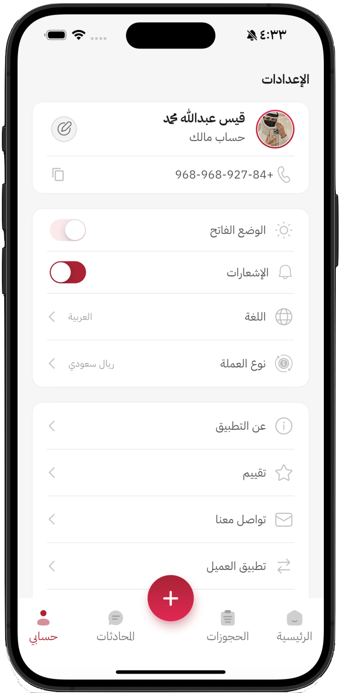
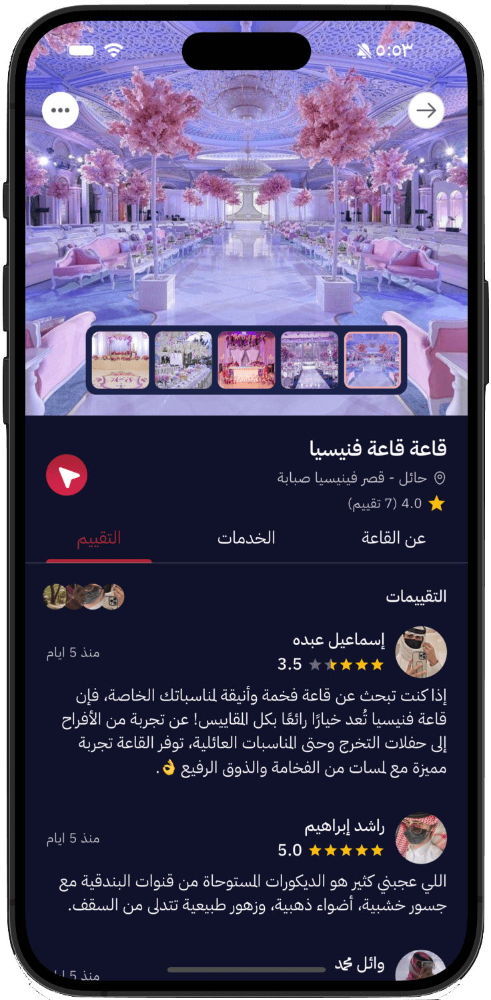

<!-- PROJECT LOGO -->
<br />
<div align="center">
 
  <!-- <a href="https://github.com/najeebaslan/AppIssue">
    
  </a> -->

<h2 align="center"></h2>


  <p align="center">
"Munasab Manager" is a comprehensive event management application that allows you to add your specialized event services and showcase them to clients.
    <br />
    <br />
    <p>      
      <a href='https://play.google.com/store/apps/details?id=najeeb.aslan.wedding_hall_booking&pcampaignid=web_share'>
        
      </a>
    </p>
  </p>
</div>

## About The Project
"Munasab Manager" is a comprehensive event management application that allows you to add your specialized event services and showcase them to clients. From wedding halls to catering, fashion, sound equipment, and more. Our platform supports bilingual functionality (for both service providers and clients) with user-friendly tools and seamless management.


# Application Screens:-


<table>
  <tr>
    <td></td>
    <td></td>
    <td></td>
    <td></td>
  </tr>
</table>

<table>
  <tr>
    <td></td>
    <td></td>
    <td></td>
    <td></td>
  </tr>
</table>

<table>
  <tr>
    <td></td>
    <td></td>
    <td></td>
    <td></td>
  </tr>
</table>

<table>
  <tr>
    <td></td>
    <td></td>
    <td></td>
    <td></td>
  </tr>
</table>

<table>
  <tr>    
    <td></td>
    <td></td>
    <td></td>
    <td></td>
  </tr>
</table>

<table>
  <tr>
    <td></td>
    <td></td>
    <td></td>
    <td></td>
  </tr>
</table>

<table>
  <tr>
    <td></td>
    <td></td>
    <td></td>
    <td></td>
  </tr>
</table>

<table>
  <tr>
    <td></td>
    <td></td>
    <td></td>
    <td></td>
  </tr>
</table>

<table>
  <tr>
    <td></td>
    <td></td>
    <td></td>
    <td></td>
  </tr>
</table>

<table>
  <tr>
    <td></td>
    <td></td>
    <td></td>
    <td></td>
  </tr>
</table>

# Mobile(Tablet) Screenshots:-


<table>
  <tr>
    <td></td>
    <td></td>
  </tr>
</table>

<table>
  <tr>
    <td></td>
    <td></td>
  </tr>
</table>

<table>
  <tr>
  <td></td>
    <td></td>
  </tr>
</table>

<table>
  <tr>
    <td></td>
    <td></td>
  </tr>
</table>


# Quick Links
- [About The Project](#about-the-project)
- [Project Overview](#project-overview)
- [Application Screens](#application-screens)
- [Features](#features)
- [Technologies Used](#technologies-used)
- [Technical Architecture](#technical-architecture)
- [Platform Support](#platform-support)
- [Application Structure](#application-structure)
- [Libraries and tools used ](#libraries-and-tools-used)


## Project Overview
  - 🏛 Event halls.
  - 🎤 Audio equipment.
  - 👗 Fashion rentals.
  - 🎨 Decor services (Koshat).
  - 🍽 Meals services
  - 📸 Photography studios

## ✨Features

### 🏛 Event Halls Management  
*"Easily manage and update your event hall listings. Ensure your venues are showcased effectively to attract potential clients."*  

- Venue listing management
- Capacity and pricing configuration
- Visual showcase optimization

### 📸 Studios Management  
*"Studio spaces with information on type, size, and available equipment."*  

- Studio profile management
- Equipment inventory tracking
- Space configuration options

### 🎤 Audio-Visual Equipment  
*"Manage your AV inventory and ensure optimal condition for events. Enhance client experiences with quality tech."* 

- Equipment maintenance tracking
- Rental management system
- Technical specifications catalog

### 🍽 Catering Services  
*"Offer varied catering options and manage menus effortlessly. Ensure clients find meals for their event needs."*  

- Menu management system
- Dietary option configuration
- Service customization

### 🎨 Booth Setup (Koshat)  
*"Oversee booth setups for exhibitions and events. Customize offerings to meet client requirements."*  

- Modular design options
- Setup configuration tools
- Theme customization

### 👗 Costume Rentals  
*"Manage costume inventory for various events. Help clients find perfect attire for occasions."*  

- Inventory management
- Style categorization
- Rental scheduling

### Communication Features
💬 **Real-Time Messaging**  
- Instant text communication
- Image/document sharing
- Read receipts & typing indicators

🔔 **Notification System**  
- Push notifications
- Unread message counters
- Booking status alerts

🛡 **Security Features**  
- End-to-End Encryption
- User Verification  
- Report/Block Functionality  

### More Details
- ✔ Intuitive Booking System - Date selection, guest management.
- ✔ Smart Discovery - Location-based search with filters (price, capacity, ratings).
- ✔ Transparent Reviews - Verified customer ratings and feedback.
- ✔ Real-Time Chatting between owner service and client 💬.
- ✔ Search - Filter - Sort Details 🔍.
- ✔ Support two languages Arabic - English (🇸🇦,🇺🇸).
- ✔ Support Dark and Light Mode (☽,☀️).
- ✔ Account Signin - SignUp - Reset Password and Account delete.


## Core Technical Features
- 📱 Responsive UI Support (Mobile & Tablet)
- 🔒 Secure Authentication - Email, Google Sign-In .
- 🌍 Localization - Full RTL support for Arabic and ENglish with locale-aware formatting.
- 📱 Cross-Platform - Built with Flutter for iOS and Android.
- 💬 Chat: Firebase Realtime Database + Firestore
- 🔔 Real-Time Updates - Firebase-powered notifications.


## Technologies Used
- Frontend: Flutter (Bloc state management)
- Backend: Firebase (Auth, Firestore, Cloud Functions)
- Maps: Google Maps Platform

## Technical Architecture
```graph TD  
    A[Flutter Client] --> B[Firebase]  
    B --> C[Authentication]  
    B --> D[Firestore Database]  
    B --> E[Cloud Storage]  
    B --> F[Realtime Database]  
    A --> G[Google Maps API]  
    A --> H[Cached Network Images] 
  ```

# Platform Support
| Android | iOS |
| :-----: | :-: |
|   ✔️    | ✔️  |


## Application structure

After successful build, your application structure should look like this:

```
├── android
├── assets
├── ios
├── lib
├── main.dart
├── core
│   ├── constants
│   ├── extensions
│   ├── helper
│   ├── networking
│   ├── router
│   ├── services
│   ├── theme
│   ├── widgets
├── features
│   ├─── auth feature
│   ├─── audio feature
│   ├─── bookings feature
│   ├─── chat feature
│   ├─── home feature
│   ├─── fashion feature
│   ├─── favorite feature
│   ├─── hall feature
│   ├─── koshat feature
│   ├─── studio feature
│   ├─── meals feature
│   ├─── offers feature
│   ├─── onboarding feature
│   ├─── settings feature
│   ├─── notifications feature
└── app.dart
```


## 📚 Libraries and Tools Used

### Core Architecture
| Package | Version | Purpose |
|---------|---------|---------|
| `flutter_bloc` | ^9.1.0 | State management |
| `equatable` | ^2.0.5 | Value equality |
| `get_it` | ^8.0.3 | Dependency injection |
| `rxdart` | ^0.28.0 | Reactive extensions |

### Firebase Services
| Package | Version | Service |
|---------|---------|---------|
| `firebase_core` | ^3.13.0 | Core SDK |
| `firebase_auth` | ^5.5.2 | Authentication |
| `cloud_firestore` | ^5.6.6 | Database |
| `firebase_storage` | ^12.4.5 | File storage |
| `firebase_messaging` | ^15.2.5 | Push notifications |

### UI Components
| Package | Version | Functionality |
|---------|---------|--------------|
| `flutter_screenutil` | ^5.9.3 | Responsive design |
| `carousel_slider` | ^5.0.0 | Image carousels |
| `flutter_staggered_grid_view` | ^0.7.0 | Dynamic grids |
| `wolt_modal_sheet` | ^0.11.0 | Animated modals |
| `flutter_rating_bar` | ^4.0.1 | Rating widgets |

### Media & Assets
| Package | Version | Usage |
|---------|---------|-------|
| `cached_network_image` | ^3.4.1 | Image caching |
| `flutter_svg` | ^2.0.17 | SVG rendering |
| `image_picker` | ^1.1.2 | Image selection |
| `flutter_image_compress` | ^2.4.0 | Image optimization |

### Maps & Location
| Package | Version | Function |
|---------|---------|---------|
| `google_maps_flutter` | ^2.12.1 | Maps integration |
| `google_maps_flutter_android` | ^2.16.0 | Android maps |

### Localization
| Package | Version | Feature |
|---------|---------|---------|
| `easy_localization` | ^3.0.7+1 | Multi-language |
| `intl` | ^0.19.0 | Internationalization |

### Utilities
| Package | Version | Purpose |
|---------|---------|---------|
| `dio` | ^5.8.0+1 | HTTP client |
| `uuid` | ^4.5.1 | Unique IDs |
| `timeago` | ^3.7.0 | Relative time |
| `logger` | ^2.5.0 | Debug logging |

### Dev Tools
| Package | Version | Use Case |
|---------|---------|----------|
| `device_preview` | ^1.2.0 | App preview |
| `flutter_native_splash` | ^2.4.6 | Splash screen |
| `upgrader` | ^11.3.1 | Update prompts |